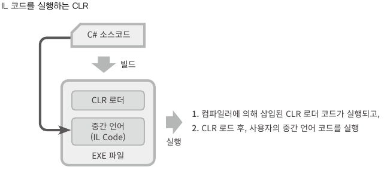
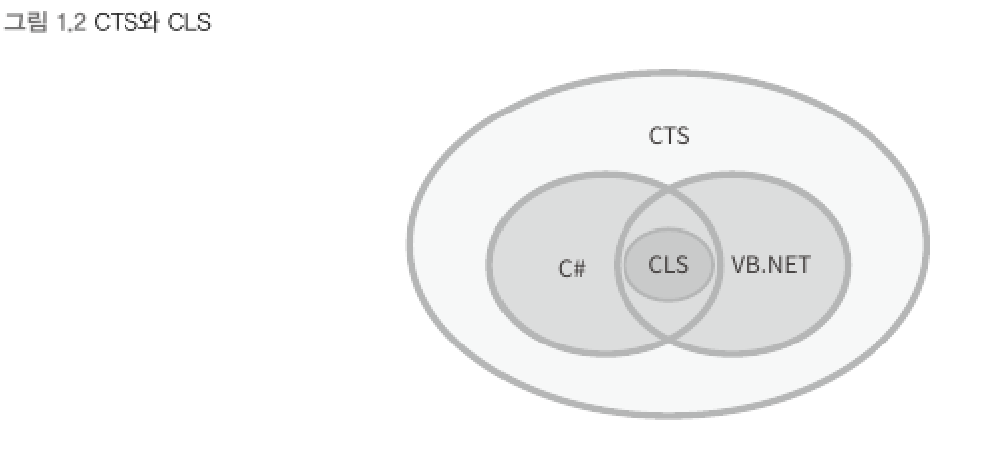

# 닷넷 프레임워크
> 2002년 마이크로소프트에서 발표한 응용 프로그램개발 환경으로서 프로세스 가상 머신에 속한다.
- 닷넷 프레임워크를 기반으로 만들어진 응용 프로그램은 반드시 닷넷 프레임워크가 미리 설치된 환경에서만 실행된다.
- 닷넷 프로그램은 외형상 EXE/DLL로 기존 프로그램과 동일한 구조다.
<br>

### CLR (Common Language Runtime) : 가상 머신 역할
> 닷넷 프레임워크 실행 구조


```
프로그램 시작 => CLR 로드 => 소스코드를 기계어가 아닌 중간 언어(IL)로 생성 => 프로그램 실행
```
<br>

### 1. 닷넷 호환 언어 (.NET-Compliant Language) : 중간 언어로 번역되는 언어
- 어떤 언어의 컴파일러든지 중간 언어로 생성하면 CLR이 실행할 수 있다.
- 닷넷 호환 언어는 IL 코드의 결과물을 공유하기 때문에 상호 호출이 가능하다.   
(다른 언어의 클래스를 사용하거나 상속받을 수 있음)
- C#, Visual Basic,  .NET, F#, C++/CLI
- COBOL, Lisp, Python, Ruby 등의 언어도 중간 언어로 산출할 수 있는 버전 존재
<br>

### 2. 공통 중간 언어 (CIL : Common Intermediate Language)
- 닷넷의 CLR에서는 중간 언어를 CIL이라고 하며 보통은 줄여서 IL 코드라고 한다.
- CPU에 독립적인 결과물로서 모든 닷넷 호환 언어는 소스코드를 IL 코드로 컴파일한다.
- CLR이 실행될 때 IL 코드를 CPU의 기계어로 최종 번역한다.
- IL 코드는 그 자체로 프로그래밍 언어 문법을 가지며 ilasm.exe라는 컴파일을 가지고 있다.   
<br>

### 3. 공용 타입 시스템 (CTS : Common Type System) : 닷넷 호환 언어가 지켜야 할 타입(Type)의 표준 규격
- 닷넷 호환 언어는 CTS의 한계를 넘어서 구현할 수 없다. (다중 상속 미지원)
- 닷넷 호환 언어가 CTS에서 정의된 모든 규격을 구혈할 필요 없다.   
(접근성 public, private,... 중 public만 지원하게 할 수 있음)
<br>

### 4. 공용 언어 사양 (CLS : Common Language Specification) : 닷넷 호환 언어가 지켜야 할 최소한의 언어 사양
- 모든 닷넷 호환 언어가 CLS에서 정의한 사양만큼은 구현해야 한다.
- 닷넷 호환 언어끼리 호출해야 하는 경우에는 그 기능에 한에서 CLS를 만족시키도록 작성해햐 한다.
> CLS, CTS, 닷넷 호환 언어의 관계 다이어그램

<br>

### 5. 메타데이터 : 데이터를 위한 데이터
- 데이터 : 개발자가 구현한 코드
- 메타데이터 : 해당 코드의 성격을 설명해 주는 별도의 데이터
```
CLR에서 동작하는 실행 파일은 완전하게 자기 서술적인 (self-descriptive) 메타데이터를 제공하며,
외부에서는 이런 정보를 리플렉션(Reflection)이라는 기술을 통해 사용할 수 있다.
```


