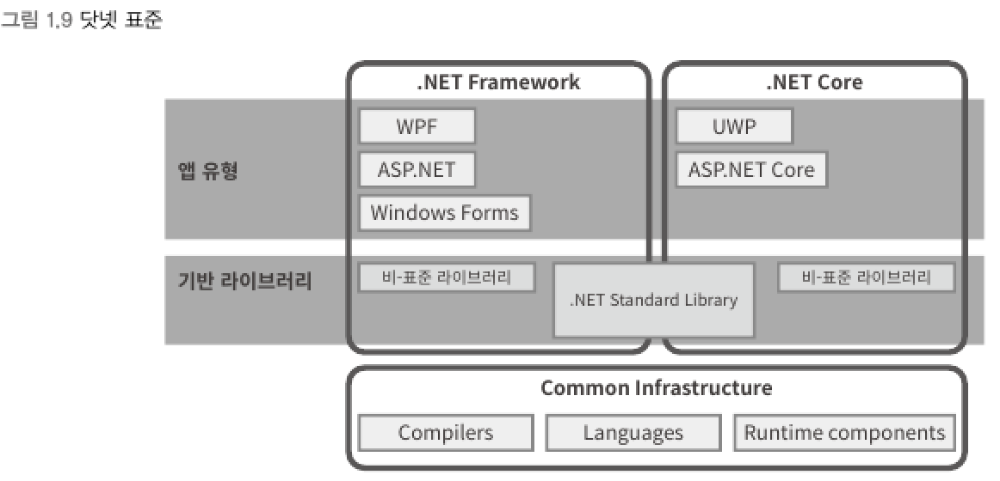

# 닷넷 코어 (.NET Core)
> 마이크로소프트에서 만든 다중 플랫폼(맥, 리눅스)에서 실행 가능한 CLI 구현체

▼ 특정 플랫폼에서만 가능한 기능을 지원할 수 없어 기반 라이브러리가 달라지는 문제 야기


- 하부 구조 (Common Infrastructure)는 공유하고 있는 반면 기반 라이브러리 단계부터는 독자적인 구현으로 이루어짐
<br>

▼ 닷넷 표준 (.NET Standard) : 기반 라이브러리의 불일치를 해결하기 위해 만든 규격



****
<br>

# 닷넷 5(.NET 5), 닷넷 6
> 기존의 닷넷 프레임워크와 닷넷 코어라는 구분을 모두 없애고 하나의 닷넷 (one .NET)이라는 기치 아래
> .NET 5 발표 그리고 개선된 `.NET 6` 출시

```
닷넷 코어 3.1을 마지막으로 '코어'라는 명칭을 사용하지 않는다.    
닷넷 프레임워크가 4.8을 마지막으로 더 이상 업데이트를 하지 않는다.    
이후 부터는 닷넷 5, 닷넷 6와 같이 "닷넷[버전 번호]"와 같은 형식의 이름으로 바뀐다.
```

****
<br>

# C# 언어를 사용한 응용 프로그램 개발 유형
- 닷넷 프레임워크
  - 윈도우 운영체제에서 실행할 프로그램 개발
<br>

- 닷넷 코어/5+
  - (특정 운영체제의 기능에 종속되지 않는) 콘솔 응용 프로그램 개발
  - (특정 운영체제의 기능에 종속되지 않는) 웹 애플리케이션 개발
  - (특정 운영체제의 기능에 종속되지 않는) 클라우드 환경 서비스 개발
  - (닷넷 코어 3.0 이후) 윈도우 운영체제에서 실행할 프로그램 지원 포함
  - 자바 스크립트의 선택 사항으로 WebAssembly를 C# 언어로 개발 또는 서버측 렌더링을 지원하는 웹 페이지 개발
  - 클라우드 및 컨테이너 환경의 응용 프로그램 개발
<br>

- Xamarin 플랫폼
  - 모바일 (OS, 안드로이드) 앱을 개발
  - 윈도우 스토어 (UWP) 앱 개발을 모바일 앱과 함께 개발
<br>

- Unity 게임 엔진 플랫폼
  - 모바일 (OS, 안드로이드)용 게임을 개발하는 경우

****
<br>
