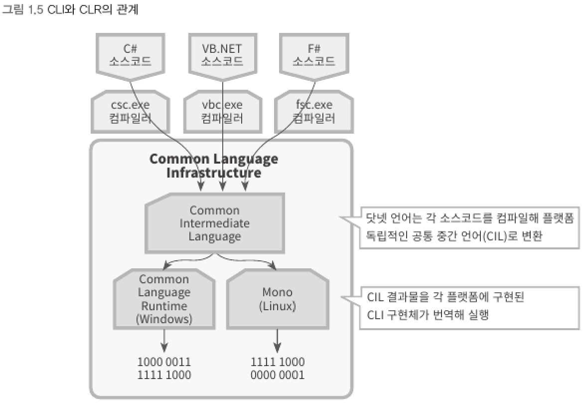

## 7. 공용 언어 기반구조 (CLI : Common Language Infrastructure)
> 마이크로소프트에서 ECMA 표준으로 제출한 공개 규약
- CLI는 CTS 명세, 중간 언어에 대한 코드 정의, 메타데이터와 그것을 포함한 이진 파일(binary file)의 구조까지 표준 사양으로 기술하고 있다.
- 공개된 CLI 사양은 누구나 가져가서 임의로 구현할 수 있다.
- CLI 사양을 준수한 구현체에서 동작하는 닷넷 파일은 또 다른 구현체에서 실행하는 것이 가능하다.

▼ CLI와 CLR의 관계



```
df
```

****
<br>
