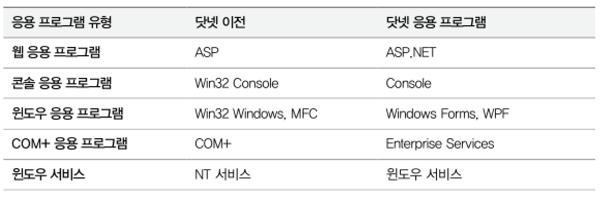

## 7. 공용 언어 기반구조 (CLI : Common Language Infrastructure)
> 마이크로소프트에서 ECMA 표준으로 제출한 공개 규약
- CLI는 CTS 명세, 중간 언어에 대한 코드 정의, 메타데이터와 그것을 포함한 이진 파일(binary file)의 구조까지 표준 사양으로 기술하고 있다.
- 공개된 CLI 사양은 누구나 가져가서 임의로 구현할 수 있다.
- CLI 사양을 준수한 구현체에서 동작하는 닷넷 파일은 또 다른 구현체에서 실행하는 것이 가능하다.

▼ CLI와 CLR의 관계 (참고만 할것)


```
CLI 규격을 마이크로소프트에서 구현한 실체가 바로 CLR이다.
```

****
<br>

## 8. 공용 언어 런타임 (CLR : Common Language Runtime)
> CLI 사양을 따른 가장 대표적인 가상 머신으로서 마이크로소프트가 개발해 윈도우 운영체제용으로만 배포되고 있다.
- 대표적인 큰 기능
  - 중간 언어를 JIT 컴파일러를 이용해 기계어로 변환하는 기능
  - 가비지 수집기 (GC : Garbage Collector)를 제공해 동적 메모리 할당 및 회수를 지원
- CLR은 프로세스(EXE) 내에서 공개된 API에 의해 로드될 수 있다.
  - CLR을 로드하는 w3wp.exe : CLR을 로드하는 코드를 작성하지 않고 닷넷 언어로 웹 애플리케이션을 만들 수 있다.
  - CLR을 로드하는 SQL 서버 : CLR을 로드해서 내장 프로시저(Stored Procedure)를 작성 가능, 칼럼의 타입을 닷넷의 클래스로 확장
  - CLR을 로드하는 명령어 셸(Shell) : 명령어 셸인 파워셸(PowerShell)에는 CLR이 기본적으로 로드돼 있어 닷넷용 명령어 사용 가능

```
CLR을 관리 환경 (Managed Environment)아라고 하고 CLR이 로드되는 프로세서를    
기존의 네이티브 프로세스와 구별해 관리 프로세스(Managed Process)라고 한다.
```
```
닷넷 호환 언어 역시 C/C++ 언어와 같은 네이티브 언어와 구분하는 의미에서    
관리 언어 (Managed Language)라고 한다.
```

- CLI, CLR, 닷넷은 보통 구분없이 사용된다는 점에 유의해야 한다.
****
<br>

### 9. 닷넷 프레임워크
> 닷넷 프레임워크 = CLR + 부가 구성 요소
- 응용 프로그램 개발에 CLR의 기능만으로는 만족할 수 없으므로 여러 가지 구성 요소를 함께 만들어 하나의 패키지로 묶어 배포하는데, 이것이 `닷넷 프레임워크`로서, 간단히 줄여 `닷넷`이라고 표현한다.
- 구성 요소에는 다음과 같은 것이 포함된다.
  - BCL (Base Class Library) : 특정 기능을 수행하는 타입을 미리 정의
  - 부가적인 실행 파일 : C#, VB.NET 컴파일러 제공, 그 밖에 각종 유틸리티 성격의 실팽 파일 포함
  - GAC (Global Assembly Cache) : 닷넷 응용 프로그램이 어셈블리 파일(DLL)을 공통적으로 찾을 수 있는 전역 저장소

▼ 닷넷 응용 프로그램은 기존의 모든 윈도우 응용 프로그램에 대응해서 만들 수 있다.



****
<br>

### 10. C#과 닷넷 프레임워크의 관계
> - C#은 닷넷 프레임워크를 기반으로 IL 코드를 생성하는 컴파일러이다.
> - C#은 마이크로소프트가 닷넷 프레임워크를 위해 만든 언어이다.

****
<br>
