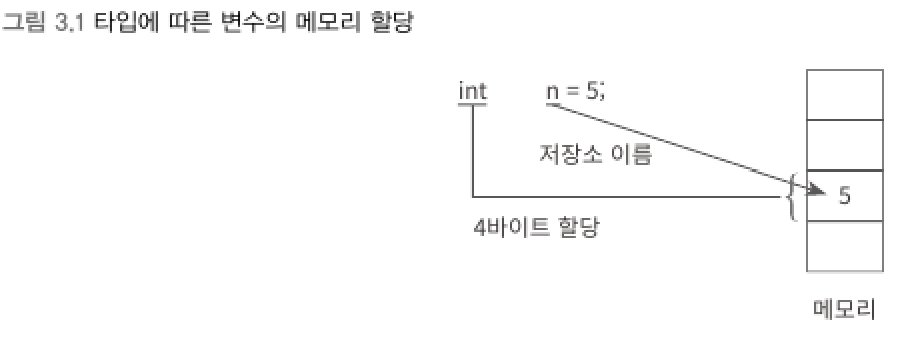
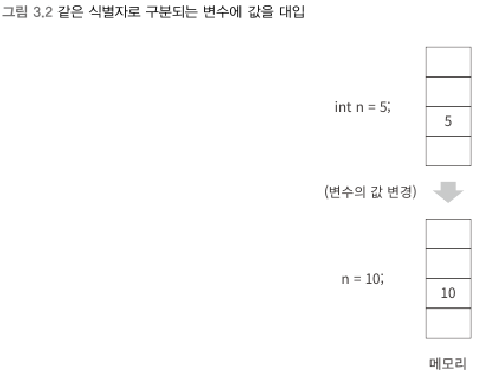
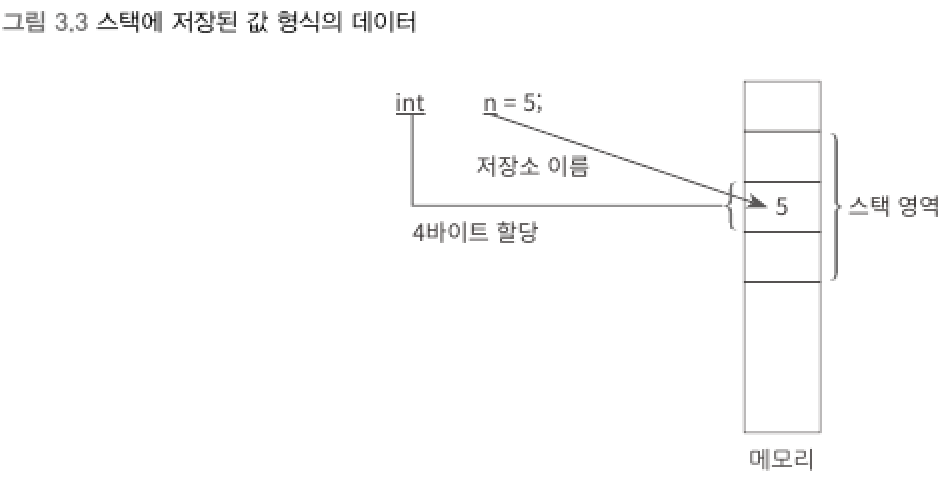
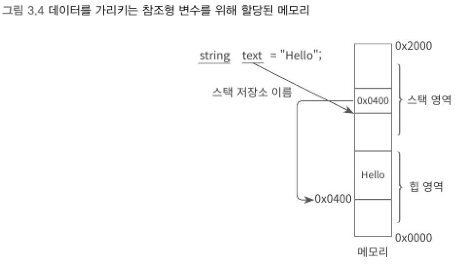

### 4) 변수 (variable)
> `식별자`의 하나로서 변수가 선언됐을 때 함께 지정된 형식의 저장소가 메모리에 할당돼 값을 담아 놓을 수 있는 역할

<br>


- `n`은 정수를 담을 수 있는 저장소에 대한 식별자로서 변수다.
- `5`는 리터럴로 개발자가 코드에 기입한 값이다.
<br>

▼ 변수는 "변하는 값"



****
<br>

## 2가지 저장소 : 스택과 힙
> 스택 (Stack)    
> 개별 스레드마다 전용으로 사용할 수 있도록 메모리에 할당되는 저장소.
- 스택 내의 메모리 영역은 C# 컴파일러에 의해 자동 할당 및 해제된다.

> 힙 (Heap)    
> 프로그램에서 필요에 의해 메모리를 사용하겠다고 요청했을 때 사용할 수 있는 저장소.
- 닷넷에서는 CLR이 직접 프로그램에서 사용될 힙을 관리한다.

```
힙에 메모리를 할당하는 것은 개발자가 명시적으로 요청한 것이므로 해제 과정이 필요하다.
```
- 네이티브 환경(C/C++ 언어)에서는 프로그램을 만들면 메모리 할당과 해제를 반드시 쌍으로 맞춰야만 한다.
- C# 프로그램이 동작하는 관리 환경의 경우 개발자는 할당만 하고 해제는 관리 환경 내의 `가비지 수집기`가 담당한다.

```
스택,힙,가비지 수집기에 대해서는 5장의 "힙과 스택"에서 더 자세히 설명한다.
```

****
<br>

## 값 형식 (Value Type)을 가리키는 변수
> `값` 자체가 스택 영역에 할당되고 변수는 그 메모리를 가리키는 프로그램 내의 식별자다.



- sbyte, byte, char, short, ushort, int, uint, long, ulong, float, double, decimal, bool
****
<br>

## 참조 형식 (Reference Type)을 가리키는 변수
> `값`을 담기 위해 별도로 힙 영역의 메모리를 할당하고, 스택의 변수 값은 다시 힙의 데이터 주소를 가리키게 된다.



- string, class, object
****
<br>


