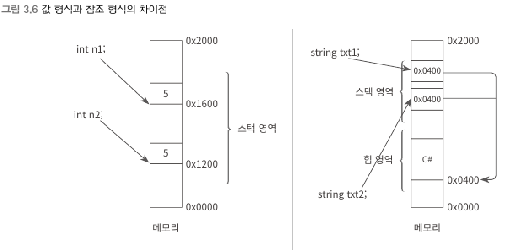

## 값을 할당하지 않은 참조 형식
> 초기화되지 않은 모든 참조형 변수는 null 값을 가진다.

```csharp
string text1;         // 숫자 0 을 담고 있음, 출력문 작성시 컴파일 에러
string text2 = null;  // 숫자 0 을 담고 있음
```
- 숫자 0 : 가리킬 수 있는 힙 주소가 없다.
- 참조형 변수에 숫자 0을 대입할 수 없으므로 null 예약어를 사용
<br>

```csharp
string name = "C#";
name = null;
```
- 참조형 변수가 더는 사용되지 않음을 명시하기 위해 null을 할당
<br>

```csharp
int n1 = 5;
int n2 = n1;
string txt1 = "C#";
string txt2 = txt1;
```
▼ n1과 n2가 같은 값이고, txt1과 txt2 역시 같은 값을 출력하지만 값 형식과 참조 형식은 메모리의 표현 방식이 서로 다르다.



****
<br>


### 4) 변수 (variable)
> 

****
<br>
### 4) 변수 (variable)
> 

****
<br>


