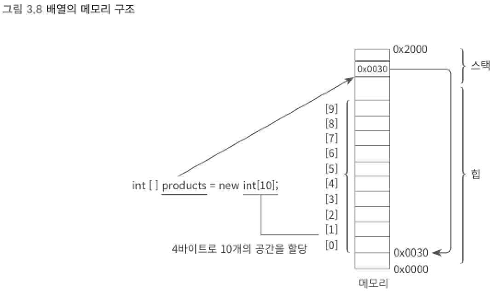

## 4. 배열 (Array)
▼ 배열의 선언
```csharp
int[] products = new int[5];
string[] names = new string[1000];
```
- `[]` : 대괄호(square bracket), 해당 변수가 배열임을 의미
- `new` : 참조 형식과 사용되는 경우 그에 필요한 메모리를 힙(heap)에 할당하는 역할

<br>
▼ 배열은 동일한 타입의 공간을 지정된 수만큼 메모리에 연속적으로 할당한다.



```
배열의 값은 별도로 힙에 할당하고 있으므로, 배열도 참조 형셕에 속한다.
```
<br>

▼ 배열의 개별 요소 접근
```csharp
products[0] = 100;
products[1] = 200;

int book = products[0];

int sum = products[0] + products[1];
```
- 대괄호 안에 지정되는 수를 인덱스(index, 색인)이라고 하며, 시작 번호가 1이 아닌 0이다. (zero-based index)
<br>

▼ 배열의 초기화
```csharp
int[] products = new int[5] { 1, 2, 3, 4, 5 };  // 배열의 요소 개수를 지정
int[] products = new int[] { 1, 2, 3, 4, 5 };   // 배열의 요소 개수를 미지정
```
<br>

▼ string
```csharp
string text = "Hello World";
char ch1 = text[0];       // 개별 char 문자에 접근
char ch2 = text[1];

Console.WriteLine(ch1);   // H 출력
Console.WriteLine(ch2);   // e 출력
// string 타입은 인덱서를 구현했기 때문에 배열처럼 다룰 수 있는 것이다.
```
<br>

▼ 한 번 정해진 배열의 크기는 고정된다.
```csharp
int[] students = new int[60];
students[0] = 50;
Console.WriteLine(students[0]);

students = new int[120];
// students 참조 변수는 새로 할당된 메모리(int[120])를 가리킴
// 이전 할당된 메모리(int[60])는 GC가 해제할 때까지 남아 있음!!
Console.WriteLine(students[0]); // 0 출력
```
<br>

▼ 배열 선언시 기본적으로 모든 값은 같은 타입에 따른 초기화 값을 가지게 된다.
```
"값 형식"의 배열이라면 기본값으로 0에 준하는 값을 가지고,    
"참조 형식"의 배열이라면 개별 요소가 null로 초기화 된다.
```

****
<br>
