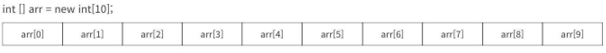
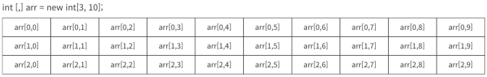
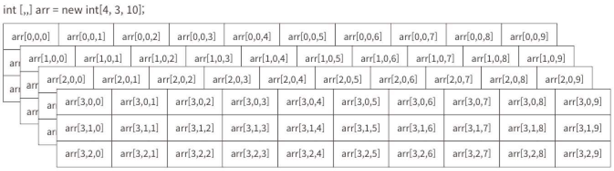
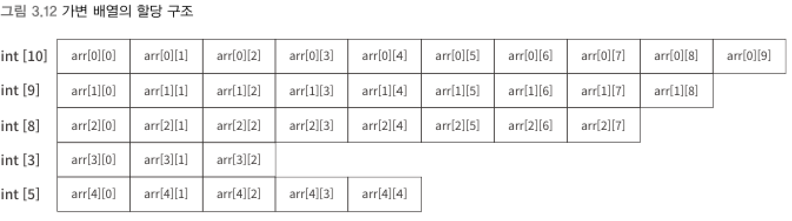

### 1) 다차원 배열 (multi-dimensional array)
> 다차원 배열은 차원 분리자인 `,`(콤마)를 이용해 선언

```csharp
int[,] arr2 = new int[10, 5];           // 2차원 배열
short[,,] arr3 = new short[8, 3, 5];    // 3차원 배열
```
- arr2는 10 x 5로 50개의 요소에 대해 각각 4바이트씩 총 200바이트의 메모리를 점유
- arr3는 8 x 3 x 10으로 240개의 요소에 대해 2바이트씩 총 480바이트의 메모리 점유
<br>

▼ 다차원 배열의 시각화




<br>

▼ 다차원 배열의 변수 선언과 초기화
```csharp
int[,] arr2 = new int[2, 3]
{
    {1, 2, 3},  // 1차원의 요소 수는 3개
    {4, 5, 6},  
};  // 2차원의 요수 수는 2개인 배열 초기화

int[,,] arr3 = new int[2, 3, 4]
{
    {
        {1, 2, 3, 4},   // 1차원의 요소 수는 4개인고,
        {5, 6, 7, 8},
        {9, 10, 11, 12},
    },  // 2차원의 요소 수는 3개인고
    {
        {13, 14, 15, 16},
        {17, 18, 19, 20},
        {21, 22, 23, 24},
    },
};  // 3차원의 요소 수는 2개인 배열을 초기화
```
- 일반적인 프로그램에서는 1차원 배열이 주로 사용된다.
- 수학의 행렬을 자주 다루는 게임 프로그래밍에서 2차원 배열이 쓰인다.
- 3차원 배열 이상은 사용 빈도가 극히 낮은 편에 속한다.

****
<br>

### 2) 가변 배열 (jagged array)

```csharp
int[][] arr = new int[5][];  // 2차원 가변 배열
arr[0] = new int[10];
arr[1] = new int[9];
arr[2] = new int[8];
arr[3] = new int[3];
arr[4] = new int[5];
```

▼ 가변 배열의 시각화



****
<br>
