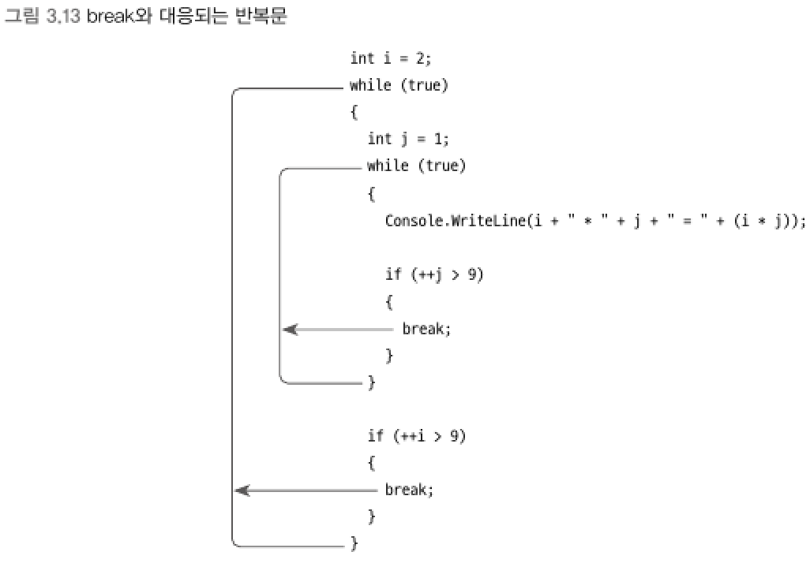

### 점프문 (jump statements)
> break, continue, goto,    
> return, throw 나중에 설명
****
<br>

### break 문
> switch와 for, foreach, while, do/while 반복문 내에서만 사용

- switch : case 실행을 벗어나는 역할
- 반복문 : break를 둘러싸고 있는 첫 번째 반복문을 탈출
<br>

▼ break 구문이 어떤 반복문을 탈촐하는지 확인


****
<br>

### continue 문
> continue 문 이후의 반복 구문 실행을 생략하고 곧바로 `조건식` 평가로 실행을 옮기면서 반복을 계속한다.
```csharp
int sum = 0;
int n = 1;

while (n++ <= 1000)
{
    if (n % 2 != 0)
    {
        continue;  // 아래의 sum += n; 구문을 건너뛰고, while 문의 조건식 평가로 실행을 옮긴다.
    }
    sum += n;
}
Console.WriteLine(sum); // 250500 출력
```


****
<br>
