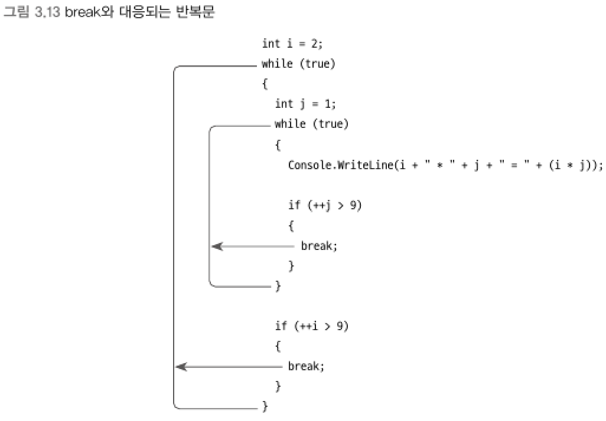

### 점프문 (jump statements)
> break, continue, goto,    
> return, throw 나중에 설명
****
<br>

### break 문
> switch와 for, foreach, while, do/while 반복문 내에서만 사용

- switch : case 실행을 벗어나는 역할
- 반복문 : break를 둘러싸고 있는 첫 번째 반복문을 탈출
<br>

▼ break 구문이 어떤 반복문을 탈촐하는지 확인


****
<br>

### continue 문
> continue 문 이후의 반복 구문 실행을 생략하고 곧바로 `조건식` 평가로 실행을 옮기면서 반복을 계속한다.
```csharp
// 0 ~ 1000 범위의 숫자 중에서 동시에 2, 3, 5 배수의 합계 
int sum = 0;
int n = 1;

while (n++ <= 1000)
{
    if (n % 2 != 0)
    {
        continue;  // 아래의 sum += n; 구문을 건너뛰고, while 문의 조건식 평가로 실행을 옮긴다.
    }
    sum += n;
}
Console.WriteLine(sum); // 250500 출력
```
****
<br>

### goto 문
> 초기 어셈블리라는 언어로 프로그램을 만들면 오직 goto/if 문으로만 반복을 구현할 수 있었다.    
> 코드의 가독성이 현저하게 떨어져 지금은 잘 사용하지 않음
```csharp
LOOP:
            n++;
            if (n > 1000)
            {
                goto LOOPEXIT;
            }

            if (n % 2 != 0) goto LOOP;

            sum += n;
            goto LOOP;
LOOPEXIT:
            Console.WriteLine(sum);
```
<br>

▼ `중첩 루프에서 탈출`은 goto 문이 유일하게 유용함
```csharp
bool exitLoop = false;

for (int x = 2; x < 10; x++)
{
    for (int y = 1; y < 10; y++)
    {
        Console.WriteLine(x + " * " + y + " = " + (x * y));

        exitLoop = x == 5 && y == 8;
        if (exitLoop == true)
        {
            break;
        }
    }

    if (exitLoop == true)
    {
        break;
    }
}
```
- 구구단 프로그램에서 중간의 5 * 8까지만 출력하고 끝내는 코드
```csharp
for (int x = 2; x < 10; x++)
{
    for (int y = 1; y < 10; y++)
    {
        Console.WriteLine(x + " * " + y + " = " + (x * y));

        if (x == 5 && y == 8) goto LOOP_EXIT;
    }
}

LOOP_EXIT: ;
```
- goto 문 사용으로 이해하기 쉬운 구조로 바뀐다.

****
<br>
