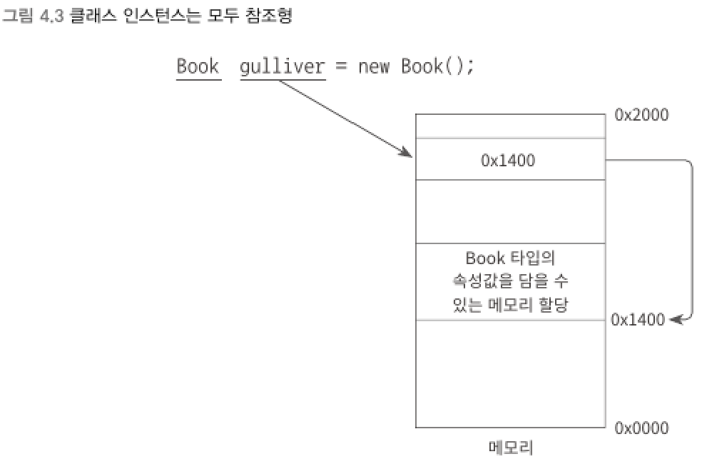

# 4장 C# 객체지향 문법
> Object-Oriented Programming    
> C#은 객체지향 프로그래밍 언어 (OOP Language) 이다.
<br>


## 1) 클래스
> 기본 타입 외에 개발자가 원하는 모든 객체의 타입을 새롭게 정의해서 사용    
> C#에서 타입 정의를 위해서 `class` 예약어 제공
<br>

````csharp
class 클래스_명
{
    // 속성 정의;
    // 행위 정의;
}
````
- 클래스명은 식별자이기 때문에 사용자가 임의로 정의하는 것이 가능
<br>

▼ 클래스로 정의된 타입은 모두 "참조형"으로 분류


****
<br>


