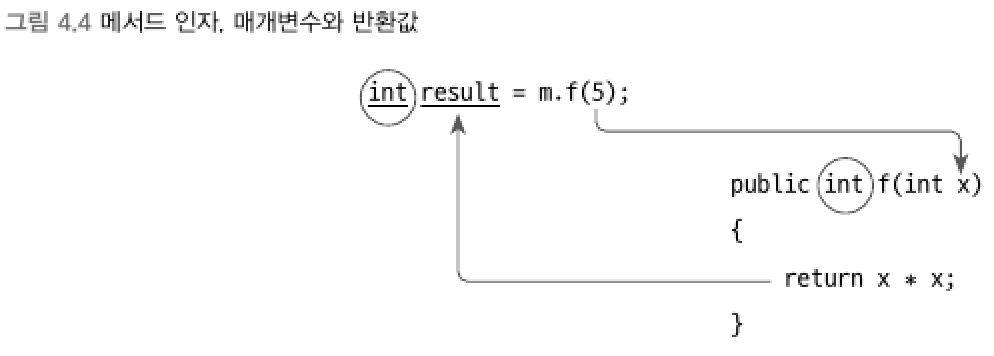

### 2) 메서드 (method)
> 클래스 내에 정의되는 행위에 해당, 함수(function)라고도 한다.

```csharp
// 메서드가 값을 반환하는 경우
반환타입 메서드명([타입명] [매개변수명], ......)
{
        // 코드 : 메서드의 본문 (body)
        return [반환타입에 해당하는 표현식];
}

// 메서드가 값을 반환하지 않는 경우
void 메서드명([타입명] [매개변수명], ......)
{
        // 코드 : 메서드의 본문 (body)
}
```
- 클래스를 기반으로 하는 C# 언어에서는 클래스 밖에서 메서드를 정의할 수 없다.
- void 예약어 : 값을 반환하지 않는 메서드에서 명시, 메서드 본문에 return 문이 없어도 된다.
- 매개변수 (parameter) : 외부에서 값을 전달받아 메서드 본문 내에서 일반적인 변수처럼 사용할 수 있다. 전달할 값이 없다면 생략할 수 있다.
- 메서드명과 매개변수명은 각각 식별자에 해당하므로 사용자가 임의의 이름을 지정할 수 있다.
<br>

> 수학의 함수와 C# 메서드와 차이점
> - C#은 값을 반환하지 않는 함수를 정의할 수 있다.
> - C#은 전달하는 값과 반환하는 값의 자료형을 명시해야 한다.
<br>

▼ 인자 (argument)



- 메서드를 호출하는 측에서 전달하는 값(예: 5)은 메서드의 `인자`라고 한다.
- 메서드 내에서 전달된 인자 값을 매개변수 (예: int x)에 대응시켜 사용할 수 있다.
- C# 언어에서는 메서드에서 반환되는 값의 범위를 개발자가 미리 예상할 수 있도록, 반환되는 값의 타입(예: int)을 지정해야 한다.
<br>

```csharp
using System;

namespace ConsoleApp1
{
    class Mathematics
    {
        public int GetAreaOfSquare(int x)
        {
            return x * x;
        }

        // 매개변수는 없고 값만 반환
        public int GetValue()
        {
            return 10;
        }

        // 2개의 매개변수를 받고, 반환값이 없음
        public void Output(string prefix, int value)
        {
            Console.WriteLine(prefix + value);
        }
    }

    class Program
    {
        static void Main(string[] args)
        {
            Mathematics m = new Mathematics();
            int result = m.GetAreaOfSquare(m.GetValue()); // 메서드를 메서드의 인자로 전달

            m.Output("결과: ", result);
        }
    }
}
```
- 타입만 일치한다면 어떤 표현식이든 메서드의 인자로 전달할 수 있다.

****
<br>

▼ return 문은 값을 반환하는 목적 말고도 접프 구문의 역할도 수행한다.
```csharp
public void WriteIf(bool output, string txt)
{
    if (output == false)
    {
        return; // 점프 구문
    }

    Console.WriteLine(txt);
}
```

****
<br>

