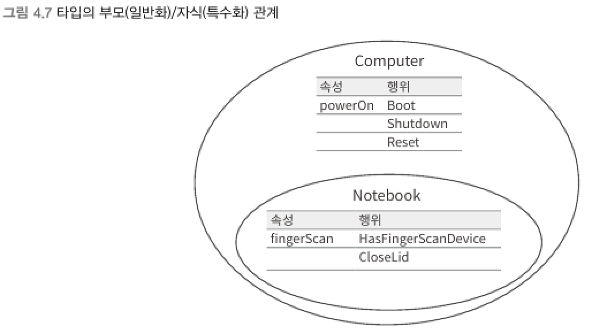

### 1) 형변환
> 암시적 형변환 (Implicit conversions)    
> 특수화 타입의 변수에서 일반화된 타입의 변수로 값이 대입되는 경우

```csharp
short a = 100;
int b = a;          // 암시적 형변환
```
<br>

> 명시적 형변환 (Explicit conversions)    
> 일반화 타입의 변수에서 특수화된 타입의 변수로 값이 대입되는 경우

```csharp
int c = 100;
short d = (short)c; // 명시적 형변환
```
<br>

▼ 이 규칙은 class로 정의된 타입의 부모/자식 관계에서도 동일하게 적용된다.




****
<br>
