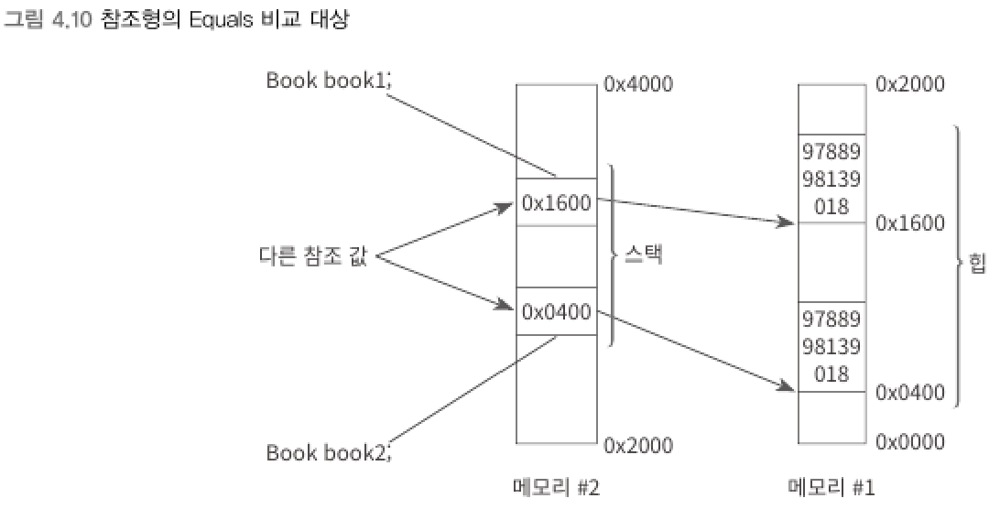

### Equals
> 값을 비교한 결과를 불린형으로 반환한다.
<br>

▼ 비교 대상 : 값 형식
```csharp
int n = 5;
Console.WriteLine(n.Equals(5));         // True 출력

int n1 = 5;
int n2 = 5;
Console.WriteLine(n1.Equals(n2));       // True 출력

n2 = 6;
Console.WriteLine(n1.Equals(n2));       // False 출력
```
- 값 형식에 대해서는 해당 인스턴스가 소유하고 있는 값을 대상으로 비교한다.
<br>

▼ 비교 대상 : 참조 형식
```csharp
class Book
{
    decimal _isbn;

    public Book(decimal isbn)
    {
        _isbn = isbn;
    }
}

class Program
{
    static void Main(string[] args)
    {
        Book book1 = new Book(9788998139018);
        Book book2 = new Book(9788998139018);
        Console.WriteLine(book1.Equals(book2)); // False 출력
    }
}
```
<br>

▼ 




****
<br>
