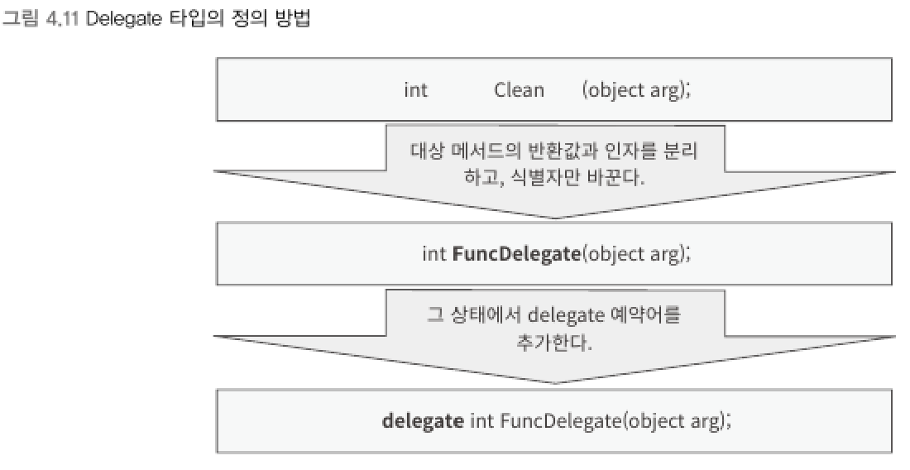

### 델리게이트 (delegate)
> 메서드를 가리킬 수 있는 타입

```csharp
접근제한자 delegate 대상_메서드의_반환타입 식별자(...... 대상_메서드의_매개변수_목록 ......)
```
- 대상이 될 메서드의 반환 타입 및 매개변수 목록과 일치하는 델리게이트 타입을 정의한다.
- 참고로 C/C++ 에서는 델리게이트를 함수 포인터라고 한다.
<br>

▼ delegate 정의 방법    

<br>

```csharp
namespace ConsoleApp1
{
    class Program
    {
        static void Main(string[] args)
        {
            Disk disk = new Disk();
            // 델리게이트 타입의 인스턴스 생성
            FuncDelegate cleanFunc = new FuncDelegate(disk.Clean);
        }

        delegate int FuncDelegate(object arg);  // 델리게이트 타입 정의

        public class Disk
        {
            public int Clean(object arg)
            {
                Console.WriteLine("작업 실행");
                return 0;
            }
        }
    }
}
```
<br>

▼ new 없이 대입 가능    
```csharp
FuncDelegate cleanFunc = new FuncDelegate(disk.Clean);
FuncDelegate workFunc = disk.Clean;  // 위와 동일 코드
```


****
<br>
