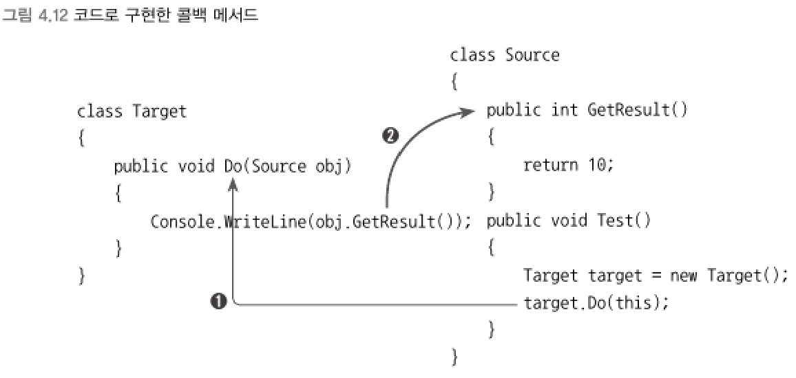

### 콜백 메서드 (callback)
```
사용자가 만든 Source 타입에서 Target 타입 내에 정의된 메서드를 호출한다면,    
호출자`caller`는 Source가 되고 피호출자`Callee`는 Target이 된다.
```
- `콜백` : 역으로 피호출자에서 호출자의 메서드를 호출하는 것
- `콜백 메서드` : 역으로 호출된 `호출자 측의 메서드`
<br>

▼ 콜백 메서드 설명    


- (1) Source 타입이 호출자이고 Target 타입이 피호출자가 된다.
- (2) 피호출자가 정의한 Do 메서드 내부에서 다시 호출자의 타입에 정의된 메서드를 호출하고 있다.    
이것을 `콜백`이라고 하고 Source 타입의 GetResult 멤버가 `콜백 메서드`가 된다.

****
<br>

### 콜백 호출 패턴에서의 델리게이트
```csharp
delegate int GetResultDelegate();   // int를 반환하고 매개변수가 없는 델리게이트 타입 정의

class Target
{
    public void Do(GetResultDelegate getResult)
    {
        Console.WriteLine(getResult()); // 콜백 메서드 호출
    }
}

class Source
{
    public int GetResult()          // 콜백 용도로 전달될 메서드
    {
        return 10;
    }

    public void Test()
    {
        Target target = new Target();
        target.Do(new GetResultDelegate(this.GetResult));
    }
}
```
```
피호출자가 호출하게 될 메서드가 꼭 호출자 내부에 정의된 메서드로 한정되지 않는다.
다른 타압에 정의된 메서드를 피호출자에 전달해서 호출되어도 `콜백`이라고 한다.
```
- Target 타입의 Do 메서드를 호출하면서 콜백 메서드를 전달했다.
- 이로 인해 Do 메서드는 내부의 동작에 콜백 메서드를 반영하게 된다.
> 이것음 마치 이미 정의돼 있는 메서드 내의 특정 코드 영역을 `콜백 메서드`에 정의된 코드로 치환하는 것과 같은 역할을 한다.
<br>

▼ 선택 정렬
```csharp
class SortObject    // 배열을 정렬할 수 있는 기능을 가진 타입 정의
{
    int[] numbers;

    public SortObject(int[] numbers) // 배열을 생성자의 인자로 받아서 보관
    {
        this.numbers = numbers;
    }

    // 전형적인 선택 정렬 알고리즘을 구현한 메서드
    public void Sort()  // numbers 배열의 요소를 크기순으로 정렬
    {
        int temp;

        for (int i = 0; i < numbers.Length; i++)
        {
            int lowPos = i;

            for (int j = i + 1; j < numbers.Length; j++)
            {
                if (numbers[j] < numbers[lowPos])
                {
                    lowPos = j;
                }
            }

            temp = numbers[lowPos];
            numbers[lowPos] = numbers[i];
            numbers[i] = temp;
        }
    }

    public void Display()   // numbers 요소를 화면에 출력
    {
        for (int i = 0; i < numbers.Length; i++)
            Console.Write(numbers[i] + "\t");
    }
}

static void Main(string[] args)
{
    int[] intArray = new int[] { 5, 2, 3, 1, 0, 4 };

    SortObject so = new SortObject(intArray);
    so.Sort();
    so.Display();  // 0  1  2  3  4  5
}
```

****
<br>
