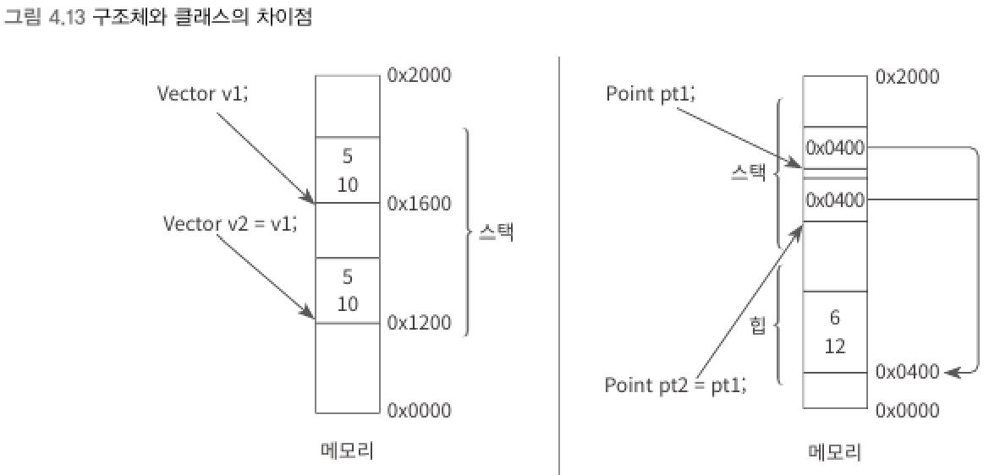

### 깊은 복사 (deep copy)와 얕은 복사 (shallow copy)
> 깊은 복사 : 값 형식의 대입은 인스턴스의 메모라 자체가 복사
> 얕은 복사 : 참조 형식의 대입은 메모리를 가리키는 참조 주소를 복사

```csharp
struct Vector
{
    public int x;
    public int y;
}

class Point
{
    public int x;
    public int y;
}

static void Main(string[] args)
{
    Vector v1;
    v1.x = 5;
    v1.y = 10;

    Vector v2 = v1;     // 값 형식의 대입

    Point pt1 = new Point();
    pt1.x = 6;
    pt1.y = 12;

    Point pt2 = pt1;    // 참조 형식의 대입
}
```
<br>

▼ 구조체와 클래스의 차이점    


<br>

▼ 깊은 복사 (deep copy)
```csharp
Vector v1;

v1.x = 5;
v1.y = 10;

Vector v2 = v1; // 값 형식의 대입은 인스턴스의 메모리 자체가 복사됨

v2.x = 7;
v2.y = 14;

Console.WriteLine("v1: X = " + v1.x + ", Y = " + v1.y); // v1: X = 5, Y = 10
Console.WriteLine("v2: X = " + v2.x + ", Y = " + v2.y); // v2: X = 7, Y = 14
```
- v1의 값을 v2에 대입하는 것은 메모리 상에서 깊은 복사가 일어나고 v2는 새로운 인스턴스를 가르키게 된다.
- 따라서 v2의 값을 바꿔도 그 변화가 v1과는 전혀 무관하게 이뤄진다.
<br>

▼ 얕은 복사 (shallow copy)
```csharp
pt1.x = 5;
pt1.y = 10;

Point pt2 = pt1; // 참조 형식의 대입은 참조 주소만 복사됨

pt2.x = 7;
pt2.y = 14;

Console.WriteLine("pt1: X = " + pt1.x + ", Y = " + pt1.y); // pt1: X = 7, Y = 14
Console.WriteLine("pt2: X = " + pt2.x + ", Y = " + pt2.y); // pt2: X = 7, Y = 14
```
- pt1과 pt2는 같은 메모리 상의 인스턴스를 가리키고 있으므로 둘 중 어느 하나라도 해당 필드의 값을 변경하면 변경된 결괏값을 보여준다.
<br>

▼ 메서드에 넘기는 인자
```csharp
static void Main(string[] args)
{
    Vector v1;

    v1.x = 5;
    v1.y = 10;

    Change(v1); // 메서드 호출 후 v1의 값에는 변함이 없음
    Console.WriteLine("v1: X = " + v1.x + ", Y = " + v1.y); // v1: X = 5, Y = 10
}

private static void Change(Vector vt)
{
    vt.x = 7;
    vt.y = 14;
}
```
- 값 형식의 v1 인스턴스는 메서드로 전달될 때 복제되어 또 다른 인스턴스가 생성되고 해당 인스턴스를 새롭게 vt 변수가 가리킨다.
- 따라서 Change 메서드 내에서 vt의 변수 값을 변경하는 것은 원래의 v1 변수에 영향을 미치지 않는다.
```csharp
static void Main(string[] args)
{
    Point pt1 = new Point();

    pt1.x = 5;
    pt1.y = 10;

    Change(pt1); // 메서드 호출 후 pt1의 값이 변함
    Console.WriteLine("pt1: X = " + pt1.x + ", Y = " + pt1.y); // pt1: X = 7, Y = 14
}

private static void Change(Point pt)
{
    pt.x = 7;
    pt.y = 14;
}
```
- pt1과 pt 변수는 동일한 인스턴스를 가리킨다. 메서드에 넘겨지는 것은 변수가 가진 참조 주소일 뿐이다.
- 메서드에서 값을 변경하면 참조 변수에 영향을 미친다.
<br>

> 구조체가 내부에 많은 필드를 담게 되어 크기(예:1KB이상)가 커진 경우
> - 구조체 변수를 메서드에 전달할 때마다 무거운 메모리 영역을 매번 복사하는 작업을 해야 한다는 부담이 생긴다.
> - 클래스로 정의했다면 메서드를 호출할 때마다 참조 주솟값만 복사하면 되므로 성능 향상을 가져올 수 있다.
> 참조 형식은 GC(가비지 수집기)에 의해 관리 받게 된다.
> - 잦은 참조 형식의 사용은 GC에 부담이 된다.
> - 이런 부하를 피해야 하는 경우 구조체를 선택한다.

****
<br>
