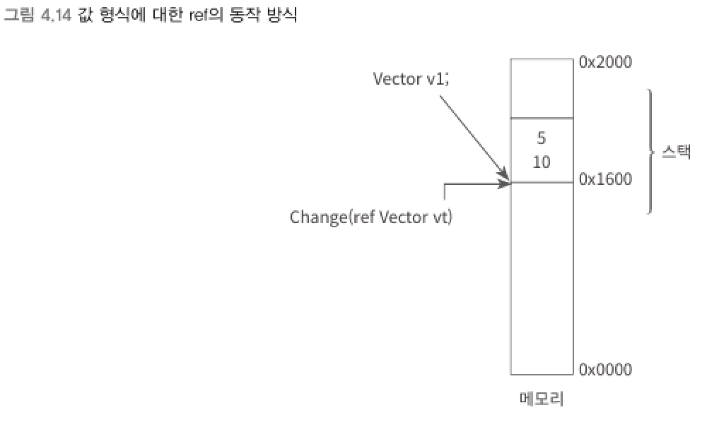

## ref 예약어
> Call By Value (값에 의한 호출, pass by value)
> - 메서드의 인자 전달에서 `변수의 스택 값`이 복사되는 것

> Call By Reference (참조에 의한 호출, pass by reference)
> - 메서드에 인자를 전달하면 해당 변수의 스택 값을 담고 있는 주소 자체가 전달되는 것

- C#에서는 `참조에 의한 호출`을 지원하기 위해 `ref`와 `out` 예약어가 있다.
- `ref` 예약어
  - 메서드의 매개변수를 선언할 때 함께 표기해야 한다.
  - 해당 메서드를 호출하는 측에서도 명시해야 한다.
<br>

▼ 값 형식의 구조체에 사용한 `ref`
```csharp
private static void Change(ref Vector vt)   // 메서드의 매개변수에 ref 사용
{
    vt.x = 7;
    vt.y = 14;
}

static void Main(string[] args)
{
    Vector v1;

    v1.x = 5;
    v1.y = 10;

    Change(ref v1); // 메서드 호출 시 ref 사용
    Console.WriteLine("v1: X = " + v1.x + ", Y = " + v1.y); // v1: X = 7, Y = 14
}
```

▼ 값 형식에 대한 ref 동작 방식    


<br>

****
<br>
