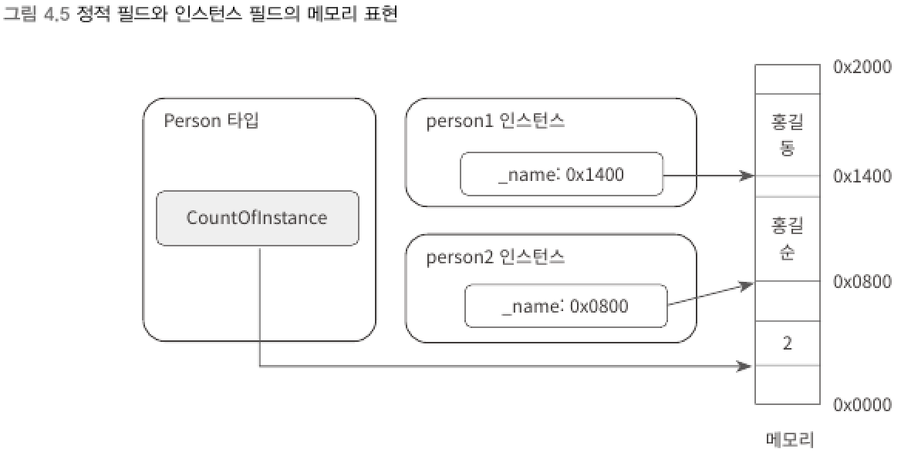

### 5) 인스턴스 멤버, 정적 멤버
> 인스턴스 (instance)
> - 어떤 타입을 실체화한 객체
> - new 연산자를 거쳐서 메모리에 할당된 객체
- 객체와 관련된 멤버를 인스턴스 멤버 (instance member)라고 한다.
- 지금까지 설명한 필드, 메서드, 생성자는 모두 여기에 속한다.

```csharp
class Program
{
    static void Main(string[] args)
    {
        Person person = new Person("홍길동");  // new를 통해 인스턴스 생성자에 접근
        Person.OutputYourName();              // new로 생성된 객체의 인스턴스 메서드를 호출
        Console.WriteLine(person._name);      // new로 생성된 객체의 인스턴스 필드에 접근
    }
}
```
<br>

> 개별 인스턴스 수준이 아닌 해당 인스턴스의 타입 전체에 결쳐 전역적으로 적용되는 필드, 메서드, 생성자가 필요할 수 있는데, 이러한 멤버를 정적 멤버 (static member)라고 한다.

****
<br>

### 정적 필드 (static field)
> 인스턴스 필드는 new로 할당받은 객체마다 고유하게 메모리를 확보하기 때문에 클래스 전역적으로 값이 유지되지 않는다.    
> 클래스 단위의 필드를 정의하는 것을 정적 필드라고 한다.

```csharp
class Person
{
    public static int CountOfInstance;  // static 예약어로 정적 필드 정의
    public string _name;                // 인스턴스 필드

    public Person(string name)
    {
        CountOfInstance++;
        _name = name;
    }
}

class Program
{
    static void Main(string[] args)
    {
        Console.WriteLine(Person.CountOfInstance);  // 0 출력

        Person person1 = new Person("홍길동");
        Person person2 = new Person("홍길순");

        Console.WriteLine(Person.CountOfInstance);  // 2 출력
    }
}
```
- static 예약어 : 정적 필드 정의
- [클래스명].[정적필드] 형태로 접근
<br>

▼ 정적 필드와 인스턴스 필드의 메모리 표현


<br>

▼ 클래스의 인스턴스를 단 하나만 만드는 예제
```csharp
class Person
{
    public static Person President = new Person("대통령");  // public 전역 필드
    string _name;

    private Person(string name) // private 인스턴스 생성자
    {
        _name = name;
    }

    public void DisplayName()   // public 인스턴스 메서드
    {
        Console.WriteLine(_name);
    }
}

class Program
{
    static void Main(string[] args)
    {
        Person.President.DisplayName();          // 정적 필드로 단일 인스턴스 접근
        Person person1 = new Person("홍길동");  // 생성자가 private이므로 오류 발생
    }
}
```
- 클래스를 이렇게 정의해 두면 외부에서 new로 객첵 생성을 할 수 없다.
- 내부에 이미 정적 필드에 인스턴스를 생성했으므로 `Person.President`로 해당 객체를 사용할 수 있다. 
<br>

> 인스턴스가 단 하나만 존재하는 타입을 `싱글턴`(singleton) 클래스라고 한다.    
> 단일 시스템 지원을 책임지는 타입이 필요할 때 싱글턴 클래스를 만들어 다른 클래스에 기능을 노출하는 용도로 사용한다.

****
<br>
