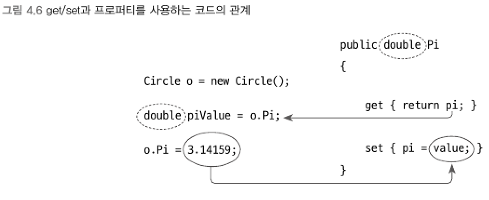

### 3) 프로퍼티 (property)
> C#의 프로퍼티는 접근자/설정자 메서드를 간편하게 만들어주는 구문이다.

```csharp
class 클래스_명
{
    접근_제한자 타입 프로퍼티_명
    {
        접근_제한자 get
        {
            // ...... 코드 ......
            return 프로퍼티의_타입과_일치하는_유형의_표현식;
        }
        접근_제한자 set
        {
            // value라는 문맥 키워드를 사용해 설정하려는 값을 표현
        }
    }
}
```
<br>

▼ 프로퍼티 사용
```csharp
class Circle
{
    double pi = 3.14;

    public double Pi
    {
        get { return pi; }
        set { pi = value; }
    }
}

class Program
{
    static void Main(string[] args)
    {
        Circle circle = new Circle();
        circle.Pi = 3.14159;           // 쓰기
        double piValue = circle.Pi;    // 읽기
    }
}
```
- 프로퍼티 정의에서는 매개변수가 없으므로 set 블록 내부에서만 사용할 수 있는 `value` 예약어가 있다.
- set 블록의 코드만 제거하면 읽기 전용 프로퍼티를 구현할 수 있다.
- set을 없애지 않고 private으로 설정하면 set 구문을 사용하면서도 캡슐화 수준을 유지할 수 있다.
<br>


<br>

▼ C# 컴파일러는 빌드하는 시점에 다음과 같이 컴파일한다.
```csharp
double pi = 3.14;

public void get_Pi()
{
    return this.pi;
}

public void set_Pi(double value)
{
    this.pi = value;
}

Circle circle = new Circle();
circle.set_Pi(3.14159);              // 쓰기
double piValue = circle.get_Pi();    // 읽기
```

****
<br>
