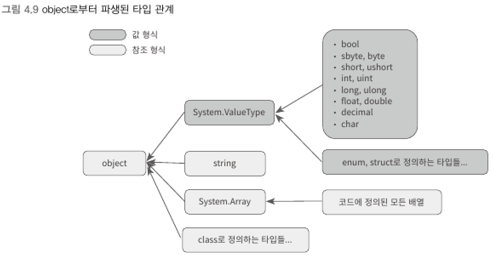

### as, is 연산자
> as 연산자    
> - 형변환이 가능하면 지정된 타입의 인스턴스 값을 반환하고, 가능하지 않으면 null을 반환한다.    
> - 참조형 변수에 대해서만 적용할 수 있고 참조형 타입으로의 체크만 가능하다.

```csharp
Computer pc = new Computer();
Notebook noteBook = pc as Notebook;

if (noteBook != null)       // 아래의 코드는 실행되지 않는다.
{
    noteBook.CloseLid();
}
```
<br>

> is 연산자    
> - 형변환의 가능성 여부를 불린형의 결괏값(true/false)으로 반환한다.    
> - 참조 형식뿐 아니라 값 형식에도 사용할 수 있다.

```csharp
int n = 5;
if (n is string)    // false
{
    Console.WriteLine("변수 n은 string 타입");
}

string txt = "text";
if (txt is int)    // false
{
    Console.WriteLine("변수 txt는 int 타입");
}
```
- C# 컴파일러는 값 형식과 참조 형식을 구분할 수 있기 때문에 위 예제 코드에서 컴파일 오류는 아니나 경고는 발생시킨다.
****
<br>

### 2) 모든 타입의 조상 : System.Object
> C#에서 정의되는 모든 클래스의 부모는 object이다.    
> System.Object는 최상위 부모 클래스이다.
- 클래스를 정의할 때 부모 클래스를 명시하지 않는다면 C#컴파일러는 기본적으로 object라는 타입에서 상속받는다고 가정하고 자동으로 코드를 생성한다.
```csharp
// 다음 코드는 완전히 동일하게 취급된다.
public class DeviceManager
{
}

public class DeviceManager : Object
{
}
```
- 부모 클래스를 지정하더라도 그 부모 클래스는 어떤 클래스를 다시 상속받았을 것이고 결국에는 최초의 클래스가 object 타입을 상속받는 것으로 끝난다.
<br>

▼ object를 이용한 형변환
```csharp
Computer computer = new Computer();
object obj1 = computer;
Computer pc1 = obj1 as Computer;

Notebook notebook = new Notebook();
object obj2 = notebook;
Notebook pc2 = obj2 as Notebook;
```
<br>

▼ object는 그 자체가 참조형임에도 값 형식의 부모 타입이기도 하다.



<br>

▼ object class
```csharp
public class Object
{
    public virtual bool Equals(object obj);
    public virtual int GetHashCode();
    public Type GetType();
    public virtual string ToString();
}
```
<br>

▼ 기본 타입 : object
|C#|닷넷 형식|설명|
|---|---|---|
|object|System.Object|모든 C#클래스의 부모|

****
<br>
