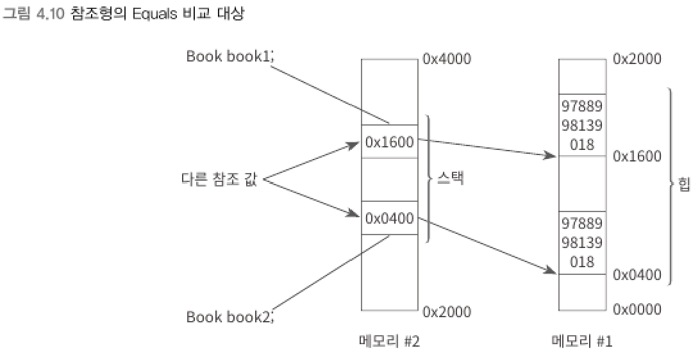

### Equals
> 값을 비교한 결과를 불린형으로 반환한다.
<br>

▼ 비교 대상 : 값 형식
```csharp
int n = 5;
Console.WriteLine(n.Equals(5));         // True 출력

int n1 = 5;
int n2 = 5;
Console.WriteLine(n1.Equals(n2));       // True 출력

n2 = 6;
Console.WriteLine(n1.Equals(n2));       // False 출력
```
- 값 형식에 대해서는 해당 인스턴스가 소유하고 있는 값을 대상으로 비교한다.
<br>

▼ 비교 대상 : 참조 형식
```csharp
class Book
{
    decimal _isbn;

    public Book(decimal isbn)
    {
        _isbn = isbn;
    }
}

class Program
{
    static void Main(string[] args)
    {
        Book book1 = new Book(9788998139018);
        Book book2 = new Book(9788998139018);
        Console.WriteLine(book1.Equals(book2)); // False 출력
    }
}
```
- 참조 형식의 경우 힙에 할당된 데이터 주소를 가리키고 있는 스택 변수의 값을 비교한다.
<br>



<br>

▼ string 참조 타압의 Equals 재정의
```csharp
string txt1 = new string(new char[] { 't', 'e', 'x', 't' });
string txt2 = new string(new char[] { 't', 'e', 'x', 't' });

Console.WriteLine(txt1.Equals(txt2));   // True 출력
```

****
<br>

### GetHashCode
> 특정 인스턴스를 고유하게 식별할 수 있는 4바이트 int 값을 반환한다.    
> Equals가 True인 객체는 서로 같음을 의미하고, 그 객체들을 식별하는 고윳값 또한 같다.    
> 때문에 Equals 메서드를 하위 클래스에서 재정의하면 GetHashCode까지 재정의해야 한다.
<br>

- int 타입의 경우 GetHashCode의 반환값과 정확히 일치하므로 닷넷 프레임워크에서는 int에 대한 GetHashCode를 재정의해 그 값을 그대로 반환한다.
- 범위가 넘어서는 경우 서로 구분되는 값인데도 동일한 해시 코드가 반환될 수 있다. 이를 해시 충돌 (hash collision)이 발생했다고 한다.
    - 해시 코드의 값이 같다면 Equals를 호출해서 정말 객체가 동일한지 판단한다.
<br>

```csharp
short s1 = 256;
short s2 = 32750;
short s3 = 256;

Console.WriteLine(s1.GetHashCode());    // 16777472 출력
Console.WriteLine(s2.GetHashCode());    // 2146336750 출력
Console.WriteLine(s3.GetHashCode());    // 16777472 출력

Book book1 = new Book(9788998139018);
Book book2 = new Book(9788998139018);
// 임의 값으로 실행할 때마다 달라짐
Console.WriteLine(book1.GetHashCode());  // 46104728 출력
Console.WriteLine(book2.GetHashCode());  // 12289376 출력

int n1 = 256;
int n2 = 2147483647;
// 1:1 매핑
Console.WriteLine(n1.GetHashCode());     // 256 출력
Console.WriteLine(n2.GetHashCode());     // 2147483647 출력
```

****
<br>
