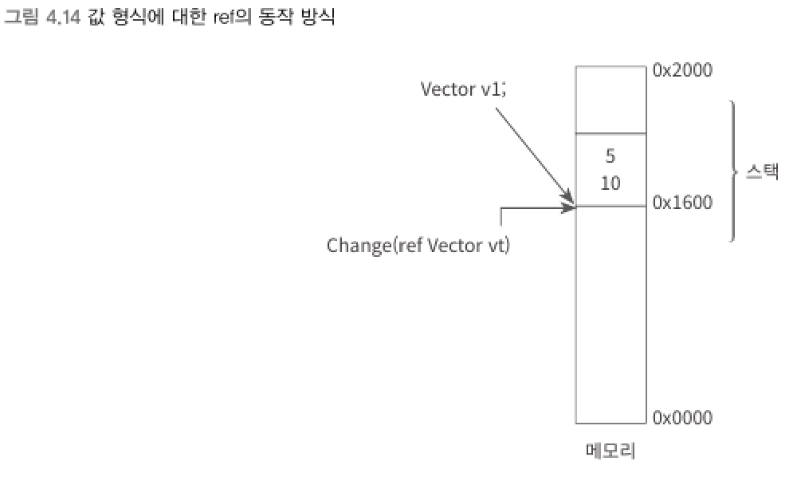
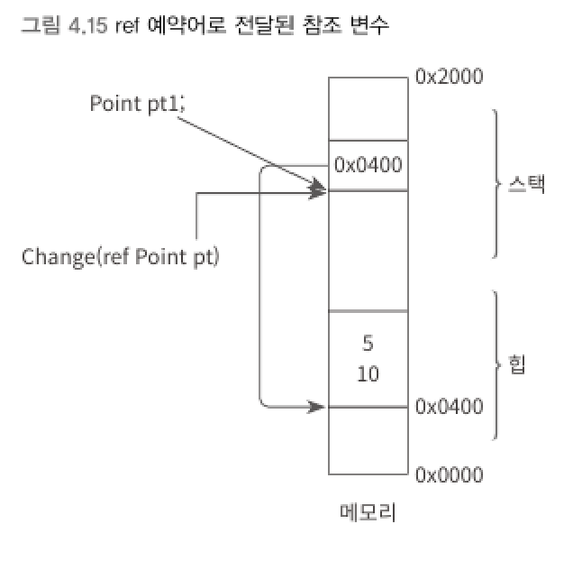
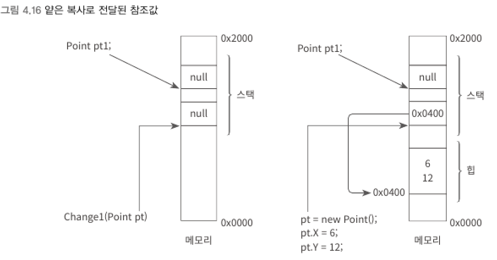
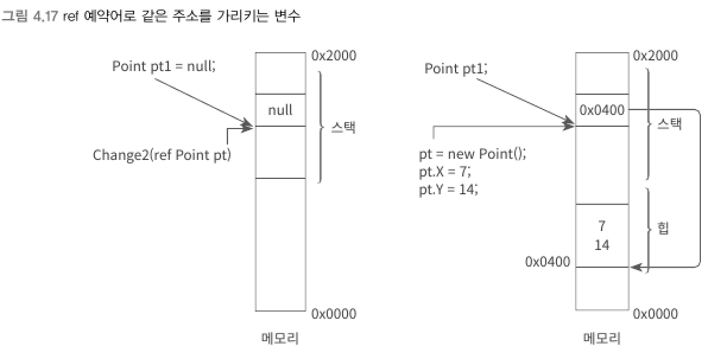

> Call By Value (값에 의한 호출, pass by value)
> - 메서드의 인자 전달에서 `변수의 스택 값`이 복사되는 것

> Call By Reference (참조에 의한 호출, pass by reference)
> - 메서드에 인자를 전달하면 해당 변수의 스택 값을 담고 있는 주소 자체가 전달되는 것

- C#에서는 `참조에 의한 호출`을 지원하기 위해 `ref`와 `out` 예약어가 있다.
<br>

## ref 예약어
- 메서드의 매개변수를 선언할 때 함께 표기해야 한다.
- 해당 메서드를 호출하는 측에서도 명시해야 한다.
<br>

> ref를 사용하지 않았을 때는 깊은 복사와 얕은 복사 모두 스택 복사가 이루어진다.

▼ 값 형식의 구조체에 사용한 `ref`
```csharp
private static void Change(ref Vector vt)   // 메서드의 매개변수에 ref 사용
{
    vt.x = 7;
    vt.y = 14;
}

static void Main(string[] args)
{
    Vector v1;

    v1.x = 5;
    v1.y = 10;

    Change(ref v1); // 메서드 호출 시 ref 사용
    Console.WriteLine("v1: X = " + v1.x + ", Y = " + v1.y); // v1: X = 7, Y = 14
}
```


- ref를 사용하게 되면 메서드의 vt 변수가 호출 측의 v1 변수와 동일한 주소를 가리키게 된다.
<br>

▼ 참조 형식의 클래스에 사용한 `ref`
```csharp
private static void Change(ref Point pt)
{
    pt.x = 7;
    pt.y = 14;
}

static void Main(string[] args)
{
    Point pt1 = new Point();

    pt1.x = 5;
    pt1.y = 10;

    Change(ref pt1); // 메서드 호출 시 ref 사용
    Console.WriteLine("pt1: X = " + pt1.x + ", Y = " + pt1.y); // pt1: X = 7, Y = 14
}
```


- 얕은 복사와 동일한 결과를 보이므로 일반적인 예제로 그 차이를 느낄 수 없다.
<br>

▼ 참조 형식의 얕은 복사와 `ref` 차이
```csharp
private static void Change1(Point pt)   // 얕은 복사
{
    pt = new Point();

    pt.x = 6;
    pt.y = 12;
}

private static void Change2(ref Point pt)   // ref를 이용한 참조에 의한 호출
{
    pt = new Point();

    pt.x = 7;
    pt.y = 14;
}

static void Main(string[] args)
{
    Point pt1 = null;

    Change1(pt1);        // 메서드 호출: 얕은 복사
    Console.WriteLine("pt1: " + pt1);  // pt1:
    // 다음 출력문 실행시 System.NullReferenceException 에러 발생
    Console.WriteLine("pt1: X = " + pt1.x + ", Y = " + pt1.y);

    Change2(ref pt1);    // 메서드 호출: ref 사용
    Console.WriteLine("pt1: X = " + pt1.x + ", Y = " + pt1.y); // pt1: X = 7, Y = 14
}
```
<br>

▼ Change1 메서드 호출    

- 참조값이 또 다른 메모리에 복사되어 전달
- 메서드 내의 new 메모리 할당이 원본 pt1 변수에 영향을 미치지 않는다.
<br>

▼ Change2 메서드 호출    

- pt1 변수의 스택 주솟값이 직접 전달
- 메서드 내의 new 메모리 할당이 원본 pt1 변수에도 반영된다.
<br>

```
메서드에서 ref 예약어를 뺴면 내부에서만 값이 바뀔 뿐 외부의 변수에 대해서는 값이 바뀌지 않는다.
```
<br>

▼ `ref`로 넘길 수 있는 인자
```csharp
int value1;                 // 값이 없으므로 ref 인자로 전달할 수 없음
string text = null;         // null 값을 가지므로 ref 인자로 전달 가능
value1 = 5;                 // 메서드 호출 전에 값을 가진다면 ref 인자로 전달 가능

Vector vt;
vt.x = 5;                   // x, y가 포함된 Vector 구조체에 y값이 초기화되지 않아 ref 인자로 부적절

Vector vt2 = new Vector();  // x, y 필드가 0으로 초기화됐으므로 ref 인자로 전달 가능
```

****
<br>
