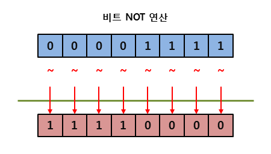

### 리터럴에도 적용되는 타입
> 코드 내에서 사용되는 리터럴도 그에 해당하는 타입이 적용

▼ 수 : int형의 인스턴스이고 값이 고정된 변수로 사용
````
Console.WriteLine(5.ToString() + 6.ToString());  // 출력 : 56
````
▼ 문자열 : string 타입의 인스턴스로 취급
````
Console.WriteLine("test".ToUpper());  // 출력 : TEST
````
<br>

### 시프트 연산자 (<<, >>)
▼ 2^0(1)부터 시작
````csharp
int n = 38;                     // 00000000 00000000 00000000 00100110
int leftShift = n << 2;         // 00000000 00000000 00000000 10011000
int rightshift = n >> 2;        // 00000000 00000000 00000000 00001001
Console.WriteLine(n);           // 38
Console.WriteLine(leftShift);   // 152
Console.WriteLine(rightshift);  // 9
````
- 좌측 시프트를 1번 할 때마다 2를 곱한 효과
  - 38 << 2 : 38 x 4 = 152
- 우측 시프트를 1번 할 때마다 2를 나눈 효과
  - 38 >> 2 : 38 / 4 = 9.5 정수로는 9

````
죄측 시프트 연산은 고려할 필요없지만 우측 시프트 연산을 할 때는 반드시 대상의 부호 유무 고려
````
<br>

### 비트 논리 연산자
|조건 논리 연산자|비트 논리 연산자|의미|
|---|---|---|
|&&|&|논리곱|
|&#124;&#124;|&#124;|논리합|
|^|^|논리 XOR|
|!|~|비트 보수 연산자|

<br>

▼ 논리곱 : 대응되는 비트가 모두 1이면 1을 반환하고, 아니면 0을 반환


<br>

▼ 논리합 : OR대응되는 두 비트 중 하나라도 1이면 1을 반환하고, 모두 0일때만 0을 반환


<br>

▼ 논리 XOR : 대응되는 두 비트가 서로 다르면 1을 반환하고, 서로 같으면 0을 반환


<br>

▼ 비트 보수 연산자 : 비트가 0이면 1, 1이면 0을 반환


<br>

### 연산자 우선순위
|우선순위|연산자 범주|연산자|
|---|---|---|
|1|기본|x.y　　x?.y　　x?[y]　　x!.y<br>f(x)　　a[x]　　x++　　x--　x!<br>new　typeof　checked　unchecked<br>default　nameof　delegate　sizeof<br>stackallock　　x->y|
|2|단항|+x　　-x　　!x　　~x　　++x　　--x<br>^x　　(T)x　await　　&x　　*x<br>true　　false|
|3|범위|x..y(range)|
|4|switch 식|switch|
|5|with 식|with|
|6|승제|x * y　　x / y　　x % y|
|7|가감|x + y　　x - y|
|8|시프트|x << y　　x >> y|
|9|관계 및 형식 테스트|x < y　　x > y<br>x <= y　　x >= y<br>is　　as|
|10|비교|x == y　　x != y|
|11|비트 논리곱|x & y|
|12|논리 XOR|x ^ y|
|13|비트 논리합|x &#124; y|
|14|조건 논리곱|x && y|
|15|조건 논리합|x &#124;&#124; y|
|16|Null 결합|x ?? y|
|17|3항 조건|c ? t:f|
|18|할당 및 람다 식|x = y　　x += y　　x -= y<br>x *= y　　x /= y　　x %= y<br>x &= y　　x &#124;= y　　x ^= y<br>x <<= y　　x >>= y　　x ??= y<br>=>|

<br>
