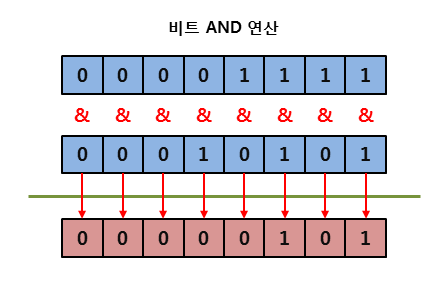
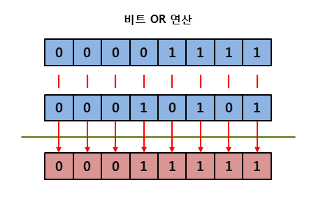
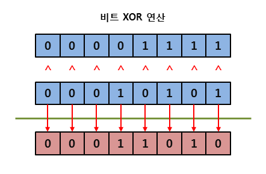

### 리터럴에도 적용되는 타입
> 코드 내에서 사용되는 리터럴도 그에 해당하는 타입이 적용

▼ 수 : int형의 인스턴스이고 값이 고정된 변수로 사용
````
Console.WriteLine(5.ToString() + 6.ToString());  // 출력 : 56
````
▼ 문자열 : string 타입의 인스턴스로 취급
````
Console.WriteLine("test".ToUpper());  // 출력 : TEST
````
<br>

### 시프트 연산자 (<<, >>)
▼ 2^0(1)부터 시작
````csharp
int n = 38;                     // 00000000 00000000 00000000 00100110
int leftShift = n << 2;         // 00000000 00000000 00000000 10011000
int rightshift = n >> 2;        // 00000000 00000000 00000000 00001001
Console.WriteLine(n);           // 38
Console.WriteLine(leftShift);   // 152
Console.WriteLine(rightshift);  // 9
````
- 좌측 시프트를 1번 할 때마다 2를 곱한 효과
  - 38 << 2 : 38 x 4 = 152
- 우측 시프트를 1번 할 때마다 2를 나눈 효과
  - 38 >> 2 : 38 / 4 = 9.5 정수로는 9

````
죄측 시프트 연산은 고려할 필요없지만 우측 시프트 연산을 할 때는 반드시 대상의 부호 유무 고려
````
<br>

### 비트 논리 연산자
|조건 논리 연산자|비트 논리 연산자|의미|
|---|---|---|
|&&|&|논리곱|
|&#124;&#124;|&#124;|논리합|
|^|^|논리 XOR|
|!|~|비트 보수 연산자|

<br>

▼ 대응되는 비트가 모두 1이면 1을 반환하고, 아니면 0을 반환


<br>

▼ 대응되는 두 비트 중 하나라도 1이면 1을 반환하고, 모두 0일때만 0을 반환


<br>

▼ 대응되는 두 비트가 서로 다르면 1을 반환하고, 서로 같으면 0을 반환


<br>

▼ 비트가 0이면 1, 1이면 0을 반환


<br>
